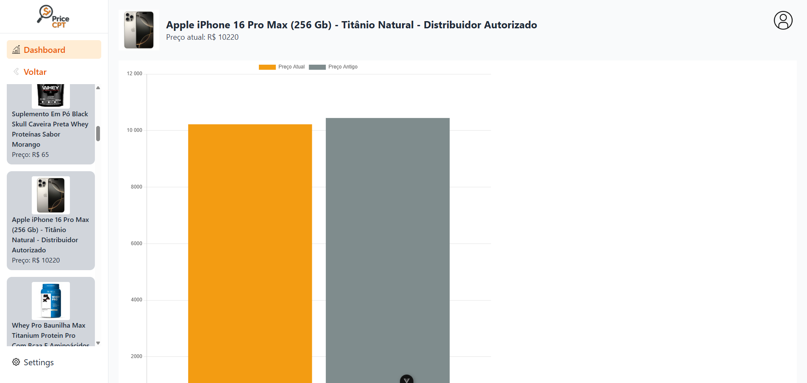

# PriceCPT - Frontend

## Descrição do Projeto

PriceCPT é um app web feito com Vue.js 3 que ajuda você a acompanhar a variação de preços de produtos do Mercado Livre.
Basta colar o link do produto e pronto: o sistema pega os dados e mostra tudo com gráficos usando Chart.js, puxando as informações de uma API.

## Backend

O backend desse projeto foi desenvolvido separadamente, utilizando **.NET 8** com Entity Framework Core e integração com a API do Mercado Livre.

Você pode acessar o repositório do backend aqui:  
[Link para o repositório do Backend](https://github.com/ojhonata/PriceCPT-BackEnd)

---

### Funcionalidades implementadas:

- Adição de produtos através da URL do Mercado Livre
- Exibição de detalhes do produto (nome, imagem e preço atual)
- Histórico de preços com gráficos interativos

### Imagens do Projeto:

- Tela de Adição de Produto:  


- Tela de Visualização de Produto:  



---

## Tecnologias Utilizadas

- Vue.js 3
- Vite
- Axios
- Chart.js
- TailwindCSS

---

## Como rodar o projeto localmente

### Pré-requisitos

- Node.js
- Git

### Instalação

Clone o repositório:

```bash
git clone https://github.com/ojhonata/PriceCPT-FrontEnd

cd PriceCPT-FrontEnd
```
Instale as dependências:
```sh
npm install
```
Inicie o servidor:
```sh
npm run dev
```

---

Feito por: <br>
Cauã Reginato RA: 1988923  <br>
Jhonata Canevare RA: 1993374 <br>
Giovanni Ferreira RA: 2005056 <br>
Eduardo Santos RA:1989619